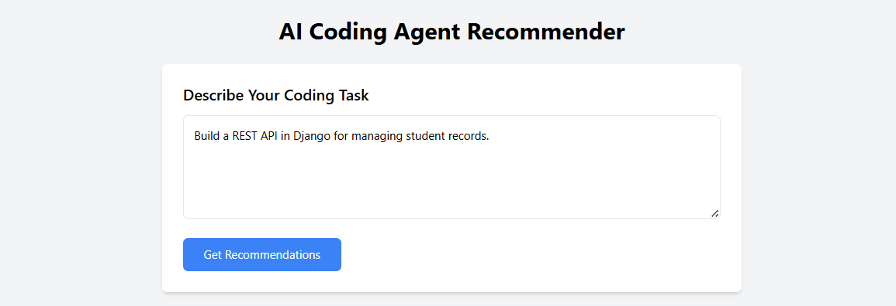
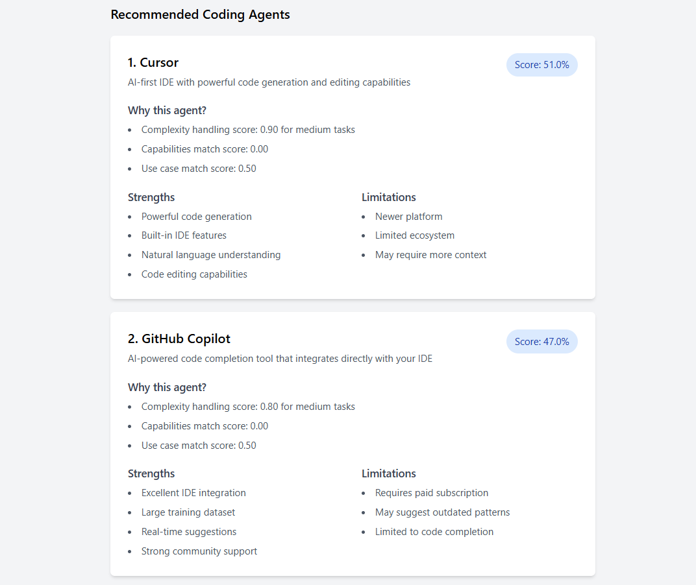

# AI Coding Agent Recommender 🤖

A sophisticated web application that recommends the best AI coding agent for your specific programming task. The system analyzes task requirements using Google's Gemini 1.5 Flash API and provides personalized recommendations based on agent capabilities, task complexity, and use case matching.

## 🌟 Features

- Natural language task description analysis
- Intelligent task complexity assessment
- Capability-based agent matching
- Detailed scoring and justification
- Modern, responsive web interface
- Real-time recommendations
- Support for multiple coding agents:
  - GitHub Copilot
  - Cursor
  - Amazon CodeWhisperer
  - Replit Ghostwriter

## 🖼️ Screenshots

### Main Interface

*The main interface where users can describe their coding task*

### Recommendations View

*Detailed agent recommendations with scoring and justifications*

## 🏗️ Project Structure

```
agent-recommender/
├── app.py                 # Main Quart web application
├── recommendation_engine.py # Core recommendation logic
├── agents_db.json         # Agent knowledge base
├── requirements.txt       # Project dependencies
├── .env                  # Environment variables (not in repo)
├── .gitignore           # Git ignore patterns
├── templates/           # HTML templates
│   └── index.html       # Main application template
└── demo/               # Demo materials
    ├── main_interface.png
    ├── recommendations.png
    └── README.md
```

## 🚀 Setup and Installation

1. Clone the repository:
   ```bash
   git clone <repository-url>
   cd agent-recommender
   ```

2. Create and activate a virtual environment:
   ```bash
   python -m venv venv
   # On Windows:
   venv\Scripts\activate
   # On Unix or MacOS:
   source venv/bin/activate
   ```

3. Install dependencies:
   ```bash
   pip install -r requirements.txt
   ```

4. Set up environment variables:
   - Create a `.env` file in the root directory
   - Add your Gemini API key:
     ```
     GEMINI_API_KEY=your_api_key_here
     ```

5. Run the application:
   ```bash
   hypercorn app:app --reload
   ```

6. Access the application at `http://localhost:8000`

## 💡 How It Works

1. **Task Analysis**
   - Uses Gemini 1.5 Flash API to analyze task descriptions
   - Extracts key features like complexity, requirements, and scale
   - Structures the analysis for scoring

2. **Agent Scoring**
   - Complexity Match (40%): How well the agent handles task complexity
   - Capabilities Match (30%): Alignment with required technical capabilities
   - Use Case Match (30%): Suitability for the project scale and type

3. **Recommendation Generation**
   - Ranks agents based on composite scores
   - Provides detailed justifications
   - Highlights strengths and limitations

## 🛠️ Technologies Used

- **Backend Framework**: Quart (async Python web framework)
- **AI/ML**: Google Gemini 1.5 Flash API
- **Frontend**: HTML5, Tailwind CSS, JavaScript
- **Database**: JSON-based knowledge base
- **Server**: Hypercorn ASGI server

## 📝 API Reference

### POST /recommend
Endpoint for getting agent recommendations.

Request body:
```json
{
    "task_description": "Your coding task description"
}
```

Response:
```json
{
    "recommendations": [
        {
            "id": "agent-id",
            "name": "Agent Name",
            "score": 0.85,
            "justification": ["reason1", "reason2"],
            "strengths": ["strength1", "strength2"],
            "limitations": ["limitation1", "limitation2"]
        }
    ]
}
```

## 🤝 Contributing

1. Fork the repository
2. Create your feature branch (`git checkout -b feature/AmazingFeature`)
3. Commit your changes (`git commit -m 'Add some AmazingFeature'`)
4. Push to the branch (`git push origin feature/AmazingFeature`)
5. Open a Pull Request

## 📄 License

This project is licensed under the MIT License - see the [LICENSE](LICENSE) file for details.

## 🙏 Acknowledgments

- Google Gemini API for natural language processing
- The open-source community for inspiration and tools
- All contributors who help improve this project 