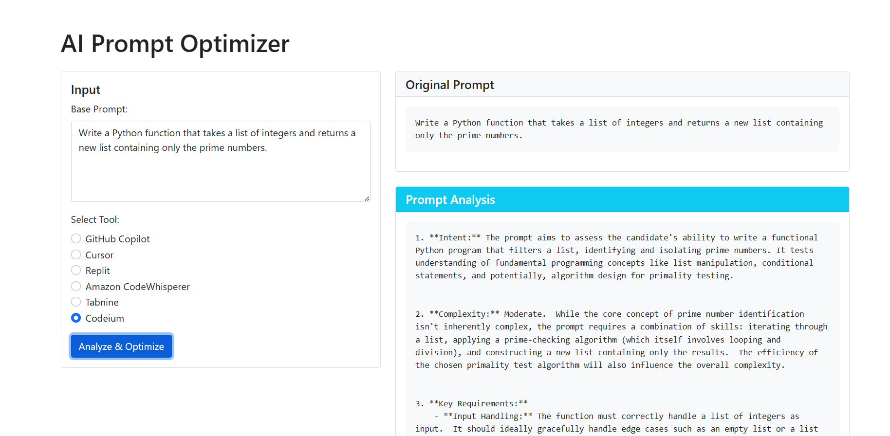
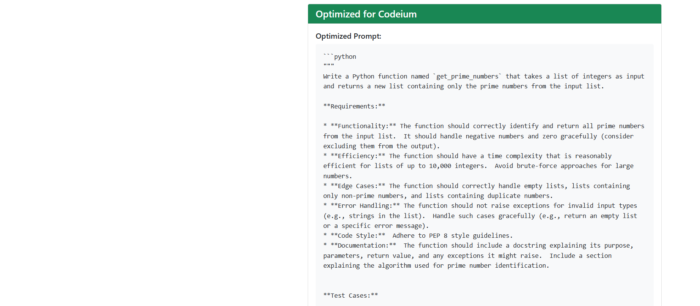

# AI Prompt Optimizer

A web-based tool that optimizes prompts for different AI coding assistants, helping developers get better results from their AI tools.

## Features

- Optimizes prompts for multiple AI coding assistants:
  - GitHub Copilot
  - Cursor AI
  - Replit AI
- Provides tool-specific optimization strategies
- Real-time prompt analysis and suggestions
- Clean and intuitive web interface
- Detailed optimization explanations

## Screenshots

To add screenshots of the UI, please take screenshots of your application and add them to a new `screenshots` directory. Then update this section with:

### Main Interface


### Results View


## Project Structure

```
ai-prompt-optimizer/
├── app.py                 # Main Flask application
├── tool_analysis.json     # Tool-specific optimization strategies
├── requirements.txt       # Python dependencies
├── templates/
│   └── index.html        # Main web interface template
├── .gitignore            # Git ignore rules
└── README.md             # Project documentation
```

## Technologies Used

- Python 3.x
- Flask (Web Framework)
- Google Gemini API (AI Model)
- HTML/CSS/JavaScript (Frontend)
- Bootstrap (UI Framework)

## Setup and Installation

1. Clone the repository:
```bash
git clone <repository-url>
cd ai-prompt-optimizer
```

2. Create and activate a virtual environment:
```bash
# Windows
python -m venv venv
venv\Scripts\activate

# Unix/MacOS
python3 -m venv venv
source venv/bin/activate
```

3. Install dependencies:
```bash
pip install -r requirements.txt
```

4. Set up environment variables:
   - Create a `.env` file in the root directory
   - Add your Google API key:
     ```
     GOOGLE_API_KEY=your_api_key_here
     ```

5. Run the application:
```bash
python app.py
```

The application will be available at `http://localhost:5000`

## Usage

1. Enter your base prompt in the input field
2. Select the target AI coding tool
3. Click "Optimize" to generate tool-specific optimizations
4. Review the optimized prompt and explanations
5. Copy and use the optimized prompt with your chosen AI tool

## API Reference

### Main Endpoint

- `POST /optimize`
  - Request body:
    ```json
    {
      "prompt": "Your base prompt",
      "tool": "selected_tool_name"
    }
    ```
  - Response:
    ```json
    {
      "optimized_prompt": "Optimized version",
      "explanation": "Optimization details"
    }
    ```

## Contributing

1. Fork the repository
2. Create a feature branch (`git checkout -b feature/improvement`)
3. Commit your changes (`git commit -am 'Add new feature'`)
4. Push to the branch (`git push origin feature/improvement`)
5. Create a Pull Request

## License

This project is licensed under the MIT License - see the LICENSE file for details.

## Acknowledgments

- Google Gemini API for providing the AI capabilities
- Flask framework for the web application structure
- Bootstrap for the UI components 